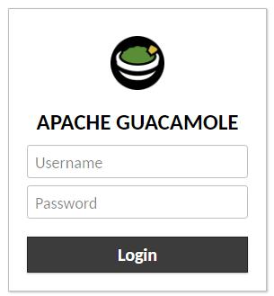
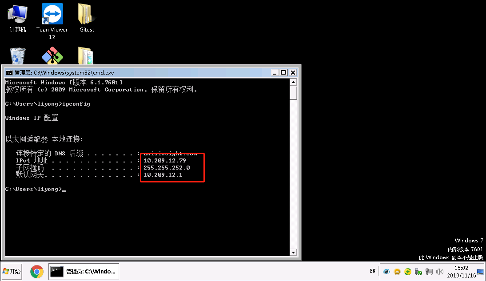

# sas (Security access system)

Security access system based on Apache Guacamole, 绿区安全访问环境，跳板机，堡垒机


Apache Guacamole 学习参考地址

*http://guacamole.apache.org/*

*http://guacamole.apache.org/doc/gug/index.html* 

*http://guacamole.apache.org/doc/gug/installing-guacamole.html*

*http://guacamole.apache.org/doc/gug/configuring-guacamole.html* 

下面的操作，以centos7为例进行！


# 0.准备工作

- [x] 将yum配置为国内源

_略_

- [x] 安装epel并配置为国内源

_略_

- [ ] 安装nux-dextop源服务 //解析远程音视频

  ```shell
  $ rpm --import http://li.nux.ro/download/nux/RPM-GPG-KEY-nux.ro
  $ rpm -Uvh http://li.nux.ro/download/nux/dextop/el7/x86_64/nux-dextop-release-0-5.el7.nux.noarch.rpm
  ```

  

# 1.Guacamole-server安装

### 1.1.编译环境依赖解决

```shell
yum install -y cairo-devel libjpeg-turbo-devel libpng-devel uuid-devel libtool

yum install -y ffmpeg-devel pango-devel libssh2-devel libtelnet-devel libvncserver-devel pulseaudio-libs-devel openssl-devel libvorbis-devel libwebp-devel

## freerdp 不能安装最新的2.几的rc版本，否则后续无法识别freerdp动态链接库文件，故离线安装
yum localinstall -y freerdp-libs-1.0.2-15.el7.x86_64.rpm freerdp-devel-1.0.2-15.el7.x86_64.rpm freerdp-plugins-1.0.2-15.el7.x86_64.rpm

yum install ghostscript ## 可选安装
```


### 1.2.开始安装guacamole-server

```she
tar -xzf guacamole-server-1.0.0.tar.gz
cd guacamole-server-1.0.0/
autoreconf -fi
./configure --with-init-dir=/etc/init.d
```

正常情况下，应输出如下：

> ```she
> config.status: creating config.h
> config.status: executing depfiles commands
> config.status: executing libtool commands
> 
> ---
> 
> guacamole-server version 1.0.0
> 
> ---
> 
> Library status:
> 
>   freerdp ............. yes
>   pango ............... yes
>   libavcodec .......... yes
>   libavutil ........... yes
>   libssh2 ............. yes
>   libssl .............. yes
>   libswscale .......... yes
>   libtelnet ........... yes
>   libVNCServer ........ yes
>   libvorbis ........... yes
>   libpulse ............ yes
>   libwebp ............. yes
>   wsock32 ............. no
> 
> Protocol support:
> 
>    RDP ....... yes
>    SSH ....... yes
>    Telnet .... yes
>    VNC ....... yes
> 
> Services / tools:
> 
>    guacd ...... yes
>    guacenc .... yes
>    guaclog .... yes
> 
> Init scripts: /etc/init.d
> Systemd units: no
> 
> Type "make" to compile guacamole-server.
> 
> [root@bogon guacamole-server-1.0.0]#
> ```


### 1.3.server安装完成

```shell
ldconfig
## 查看guacd服务状态
/etc/init.d/guacd start
```


# 2.安装guacamole-client

### 2.1.安装Jdk1.8

```shell
tar zxf jdk-8u162-linux-x64.tar.gz -C /usr/local/share/

mv /usr/local/share/jdk1.8.0_162 /usr/local/share/jdk1.8


cat >> /etc/profile <<myEOF

\## java env byLiyong

export JAVA_HOME=/usr/local/share/jdk1.8

export CLASSPATH=.:\$JAVA_HOME/lib/dt.jar:\$JAVA_HOME/lib/tools.jar

export PATH=\$JAVA_HOME/bin:\$PATH

 

myEOF

 

source /etc/profile

java -version
```


### 2.2.安装Tomcat8

```shell
tar zxf apache-tomcat-8.5.38.tar.gz -C /opt/
cd /opt/
mv apache-tomcat-8.5.38/ tomcat8
cd tomcat8/webapps/
rm -rf *
mv ~/guacamole-1.0.0.war ROOT.war

## 改Tomcat跑80端口（$TOMCAT_HOME/conf/server.xml），若加Ng前端就不用了
## 启动Tomcat
$TOMCAT_HOME/bin/startup.sh

netstat -ntlp
```

正常情况下，端口80/8009出现如下：

> ```shell
> [root@bogon tomcat8]# netstat -ntlp
> Active Internet connections (only servers)
> Proto Recv-Q Send-Q Local Address           Foreign Address         State       PID/Program name
> tcp        0      0 0.0.0.0:22              0.0.0.0:*               LISTEN      897/sshd
> tcp        0      0 127.0.0.1:25            0.0.0.0:*               LISTEN      1103/master
> tcp6       0      0 :::8009                 :::*                    LISTEN      80521/java
> tcp6       0      0 :::80                   :::*                    LISTEN      80521/java
> tcp6       0      0 :::22                   :::*                    LISTEN      897/sshd
> tcp6       0      0 ::1:25                  :::*                    LISTEN      1103/master
> [root@bogon tomcat8]#
> ```

启动guacamole-server

```shell
[root@bogon tomcat8]# /etc/init.d/guacd status
guacd is not running.
[root@bogon tomcat8]# /etc/init.d/guacd start
Starting guacd: guacd[81275]: INFO:     Guacamole proxy daemon (guacd) version 1.0.0 started
SUCCESS
[root@bogon tomcat8]#
[root@bogon tomcat8]# netstat -ntlp
Active Internet connections (only servers)
Proto Recv-Q Send-Q Local Address           Foreign Address         State       PID/Program name
tcp        0      0 127.0.0.1:4822          0.0.0.0:*               LISTEN      81277/guacd
tcp        0      0 0.0.0.0:22              0.0.0.0:*               LISTEN      897/sshd
tcp        0      0 127.0.0.1:25            0.0.0.0:*               LISTEN      1103/master
tcp6       0      0 127.0.0.1:8005          :::*                    LISTEN      80521/java
tcp6       0      0 :::8009                 :::*                    LISTEN      80521/java
tcp6       0      0 :::80                   :::*                    LISTEN      80521/java
tcp6       0      0 :::22                   :::*                    LISTEN      897/sshd
tcp6       0      0 ::1:25                  :::*                    LISTEN      1103/master
[root@bogon tomcat8]#

```


### 2.3.看下效果




# 3. Guacamole 配置

```shell
mkdir /etc/guacamole
cd /etc/guacamole
touch guacamole.properties logback.xml
mkdir extensions lib

vi user-mapping.xml # 创建简单用户-虚机映射配置文件


```

！！！ 认真阅读 *http://guacamole.apache.org/doc/gug/index.html* 网站中配置相关信息 ！！！

// 下面给出最简单的配置文件 ！

> ```shell
> [root@bogon guacamole]# cat user-mapping.xml
> <user-mapping>
> <!-- test user -->
> <authorize username="user" password="1">
>  <!-- connection to openlab -->
>  <connection name="10.209.12.79">
>      <protocol>rdp</protocol>
>      <param name="hostname">10.209.12.79</param>
>      <param name="port">3389</param>
>  </connection>
> 
>  <!-- to CAS -->
>  <connection name="myssh">
>      <protocol>ssh</protocol>
>      <param name="hostname">10.209.12.10</param>
>      <param name="port">22</param>
>  </connection>
> 
>  <!-- todo -->
>  <connection name="otherhost">
>      <protocol>vnc</protocol>
>      <param name="hostname">otherhost</param>
>      <param name="port">5900</param>
>      <param name="password">VNCPASS</param>
>  </connection>
> 
> </authorize>
> 
> </user-mapping>
> [root@bogon guacamole]#
> 
> ```

##### 为方便后续调试，编写重启脚本！

> [root@bogon guacamole]# cat /opt/restart.sh
>
> ```shell
> #!/bin/bash
> 
> /opt/tomcat8/bin/shutdown.sh
> /etc/init.d/guacd stop
> sleep 5
> /opt/tomcat8/bin/startup.sh
> /etc/init.d/guacd start
> 
> ```
>
> [root@bogon guacamole]#

重启一下，看看效果

```shell
sh /opt/restart.sh

```

> ```shell
> [root@bogon guacamole]# ps -ef |grep java
> root      9236  9235  0 16:06 pts/0    00:00:18 /usr/local/share/jdk1.8/bin/java -Djava.util.logging.config.file=/opt/tomcat8/conf/logging.properties -Djava.util.logging.manager=org.apache.juli.ClassLoaderLogManager -Djdk.tls.ephemeralDHKeySize=2048 -Djava.protocol.handler.pkgs=org.apache.catalina.webresources -Dorg.apache.catalina.security.SecurityListener.UMASK=0027 -Dignore.endorsed.dirs= -classpath /opt/tomcat8/bin/bootstrap.jar:/opt/tomcat8/bin/tomcat-juli.jar -Dcatalina.base=/opt/tomcat8 -Dcatalina.home=/opt/tomcat8 -Djava.io.tmpdir=/opt/tomcat8/temp org.apache.catalina.startup.Bootstrap start
> root     30343  1387  0 17:03 pts/0    00:00:00 grep --color=auto java
> [root@bogon guacamole]#
> 
> [root@bogon guacamole]# netstat -ntlp
> Active Internet connections (only servers)
> Proto Recv-Q Send-Q Local Address           Foreign Address         State       PID/Program name
> tcp        0      0 127.0.0.1:4822          0.0.0.0:*               LISTEN      9249/guacd
> tcp        0      0 0.0.0.0:22              0.0.0.0:*               LISTEN      897/sshd
> tcp        0      0 127.0.0.1:25            0.0.0.0:*               LISTEN      1255/master
> tcp6       0      0 127.0.0.1:8005          :::*                    LISTEN      9236/java
> tcp6       0      0 :::8009                 :::*                    LISTEN      9236/java
> tcp6       0      0 :::80                   :::*                    LISTEN      9236/java
> tcp6       0      0 :::22                   :::*                    LISTEN      897/sshd
> tcp6       0      0 ::1:25                  :::*                    LISTEN      1255/master
> [root@bogon guacamole]#
> 
> ```

*`guacamole.properties是全局配置文件，本处略`*
*`echo 'available-languages: en, de' >> guacamole.properties`*


# 4.效果展示





-End-

